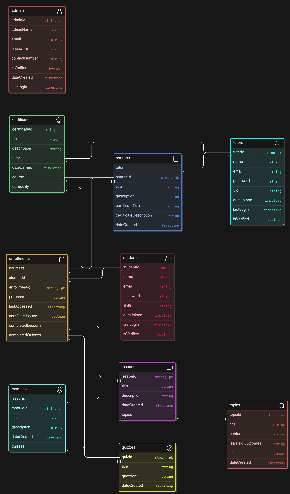
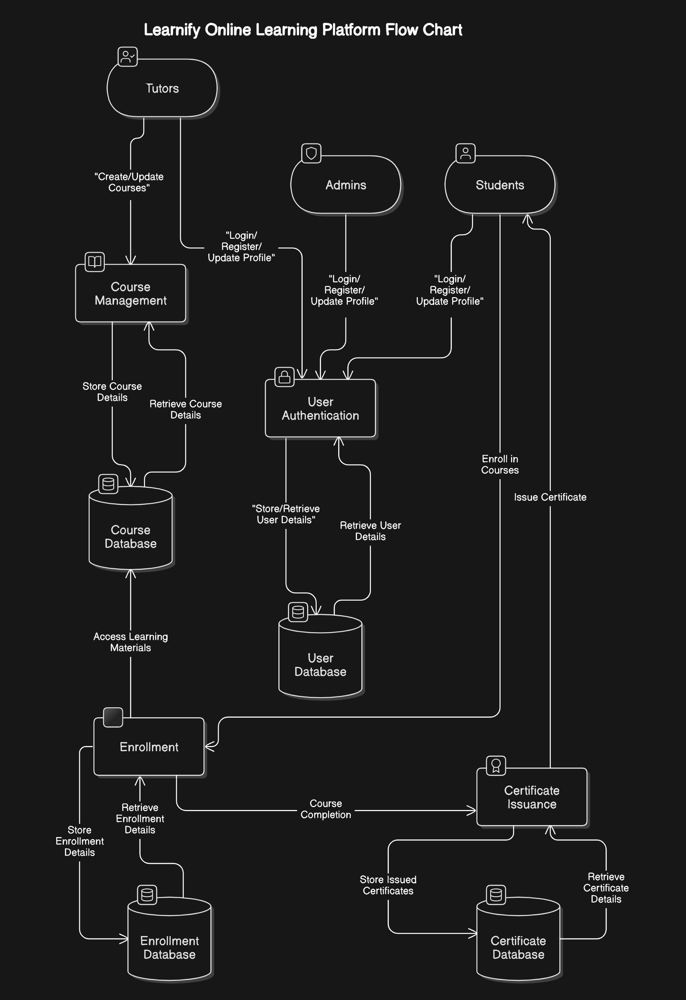

# Learnify

Learnify is an online learning platform where tutors can create courses, students can enroll in courses, and both can manage their learning experience. Admins oversee the platform, manage users, and ensure the smooth operation of the system. Upon course completion, students receive certificates.

## Features

- **Student Functionality**:
  - Register, login, and manage personal profiles.
  - Enroll in courses and access lessons and quizzes.
  - Earn certificates upon completing courses.

- **Tutor Functionality**:
  - Register and create courses with modules, lessons, and quizzes.
  - Manage course content and interact with enrolled students.

- **Admin Functionality**:
  - Manage tutors, students, and courses.
  - Access platform-wide data and oversee operations.

- **Certificate Issuance**:
  - Students earn certificates automatically upon course completion.

- **File Management**:
  - GridFS is used for secure and scalable file storage.

## Technology Stack

- **Backend**: Node.js, Express.js
- **Database**: MongoDB (with GridFS for file storage)
- **Authentication**: JWT for secure role-based access control
- **Others**: RESTful APIs

---

## API Documentation

### **Authentication Endpoints**

#### **Student Authentication**
- `POST /student-register`: Register a new student.
- `POST /student-verify`: Verify student email.
- `POST /student-login`: Login for students.
- `POST /student-forgot`: Request password reset.
- `POST /student-reset/:token`: Reset password.
- `POST /student-logout`: Logout from the platform.
- `GET /student-auth`: Authenticate student session.

#### **Tutor Authentication**
- `POST /tutor-register`: Register a new tutor.
- `POST /tutor-verify`: Verify tutor email.
- `POST /tutor-login`: Login for tutors.
- `POST /tutor-forgot`: Request password reset.
- `POST /tutor-reset/:token`: Reset password.
- `POST /tutor-logout`: Logout from the platform.
- `GET /tutor-auth`: Authenticate tutor session.

#### **Admin Authentication**
- `POST /admin-register`: Register a new admin.
- `POST /admin-verify`: Verify admin email.
- `POST /admin-login`: Login for admins.
- `POST /admin-forgot`: Request password reset.
- `POST /admin-reset/:token`: Reset password.
- `POST /admin-logout`: Logout from the platform.
- `GET /admin-auth`: Authenticate admin session.

---

### **Course Management Endpoints**

#### **For Tutors**
- `POST /create-course`: Create a new course.
- `POST /update-course`: Update an existing course.
- `POST /delete-course`: Delete a course.
- `POST /fetch-courses`: Fetch all courses created by the tutor.
- `POST /upload-image`: Upload course images.
- `GET /files/:fileId`: Retrieve uploaded files.

#### **For Students**
- `POST /enroll`: Enroll in a course.
- `POST /course`: Get details of a specific course.
- `POST /enrollments`: Get all enrolled courses.
- `POST /get-enrollment`: Get details of a specific enrollment.
- `POST /add-lesson`: Add a lesson to a course module.
- `POST /add-quiz`: Add a quiz to a course module.
- `POST /certificates`: Fetch all certificates for the student.

#### **Admin Management**
- `POST /get-all-courses`: Fetch all courses without modules.
- `POST /get-all-enrollments`: Retrieve all enrollments.

---

### **User Management Endpoints**

#### **Profile Updates**
- `POST /tutor-update`: Update tutor details.
- `POST /student-update`: Update student details.
- `POST /admin-update`: Update admin details.

#### **Admin Actions**
- `POST /get-all-admins`: Fetch all admin accounts.
- `POST /get-all-tutors`: Fetch all tutor accounts.
- `POST /get-all-students`: Fetch all student accounts.
- `POST /get-all-certificates`: Fetch all certificates issued.
- `POST /delete-batch`: Delete multiple entities in a batch.

---

## How It Works

1. **Students**:
   - Register, log in, and enroll in courses.
   - Access course materials (lessons, quizzes) and complete them at their own pace.
   - Receive certificates upon course completion.

2. **Tutors**:
   - Register, log in, and create courses with detailed modules, lessons, and quizzes.
   - Manage course content, including updates and deletions.

3. **Admins**:
   - Oversee platform operations, manage users, and access platform-wide data.
   - Perform administrative tasks like deleting data in batches.

---

# Entity-Relationship Diagram (ERD) - Learnify

The Entity-Relationship Diagram (ERD) represents the database structure of Learnify, illustrating relationships between entities and their attributes. Below is a detailed description:

---

## **Entities and Relationships**

### **1. Users**
- **Attributes**:
  - `id` (Primary Key)
  - `name`
  - `email`
  - `password`
  - `role` (Student, Tutor, Admin)
  - `profilePicture`
- **Relationships**:
  - A User can be a Student, Tutor, or Admin.

### **2. Courses**
- **Attributes**:
  - `id` (Primary Key)
  - `title`
  - `description`
  - `image`
  - `createdBy` (Foreign Key referencing Tutors)
- **Relationships**:
  - A Course is created by a Tutor.
  - A Course contains multiple Modules.

### **3. Modules**
- **Attributes**:
  - `id` (Primary Key)
  - `title`
  - `description`
  - `courseId` (Foreign Key referencing Courses)
- **Relationships**:
  - A Module belongs to one Course.
  - A Module contains Lessons and Quizzes.

### **4. Lessons**
- **Attributes**:
  - `id` (Primary Key)
  - `title`
  - `content`
  - `moduleId` (Foreign Key referencing Modules)
- **Relationships**:
  - A Lesson belongs to a Module.

### **5. Quizzes**
- **Attributes**:
  - `id` (Primary Key)
  - `title`
  - `questions` (Array of questions)
  - `moduleId` (Foreign Key referencing Modules)
- **Relationships**:
  - A Quiz belongs to a Module.

### **6. Enrollments**
- **Attributes**:
  - `id` (Primary Key)
  - `studentId` (Foreign Key referencing Users)
  - `courseId` (Foreign Key referencing Courses)
  - `status` (Enrolled, Completed)
- **Relationships**:
  - An Enrollment links a Student to a Course.

### **7. Certificates**
- **Attributes**:
  - `id` (Primary Key)
  - `enrollmentId` (Foreign Key referencing Enrollments)
  - `issuedAt`
  - `certificateFile`
- **Relationships**:
  - A Certificate is generated for an Enrollment.

---

## **Visual Representation**

---

## **Summary**
The ERD ensures a robust database structure, supporting efficient data retrieval and management across Learnify's functionalities. The relationships facilitate seamless interaction between Students, Tutors, and Admins.

---

# Data Flow Diagram (DFD) - Learnify

The Data Flow Diagram (DFD) represents the flow of information within the Learnify platform, outlining how data is processed by different components of the system. Below are the levels of the DFD:

---

## **Summary**
The DFD highlights the efficient handling of user interactions, course content, and administrative operations within the Learnify platform. Each component ensures smooth operation and data security.

---

## **Final Summary**

Learnify is a comprehensive online learning platform designed to empower tutors and students while streamlining the learning experience. With features like role-based access, detailed course management, and automated certificate issuance, Learnify fosters an engaging and efficient environment for education. The robust backend, supported by technologies like Node.js, MongoDB, and JWT authentication, ensures scalability, security, and smooth operation. 

We are committed to continuous improvement and innovation, with future enhancements planned to make learning even more interactive and personalized.

---

### **Thank You!**

We deeply appreciate your interest in Learnify. Whether you are a student, tutor, or developer, your engagement is vital to the success of this platform. Together, we can create a brighter future for education. Thank you for your support!
